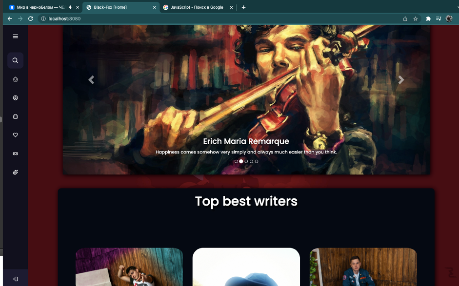
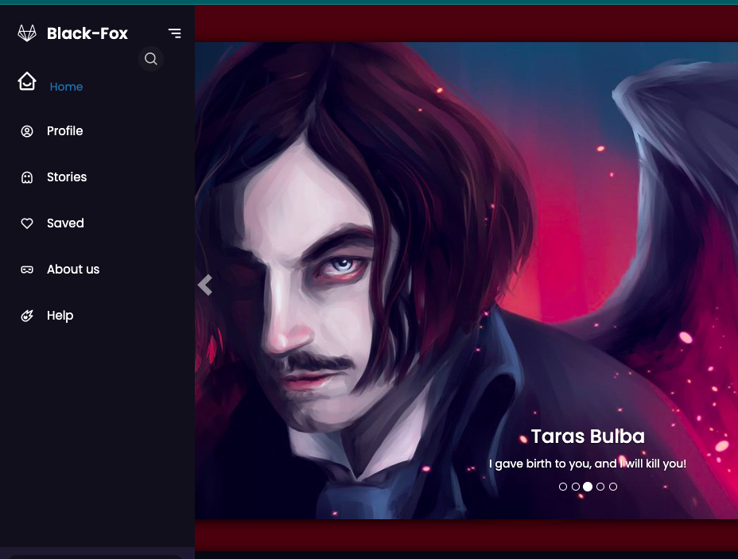
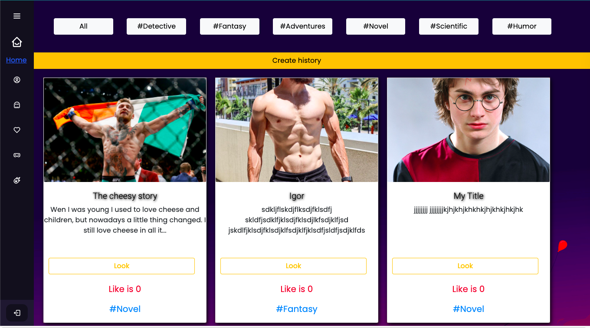
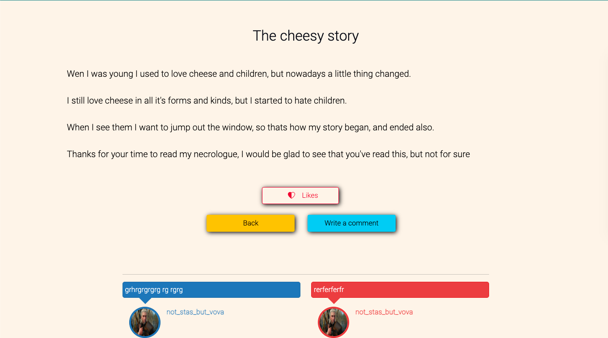
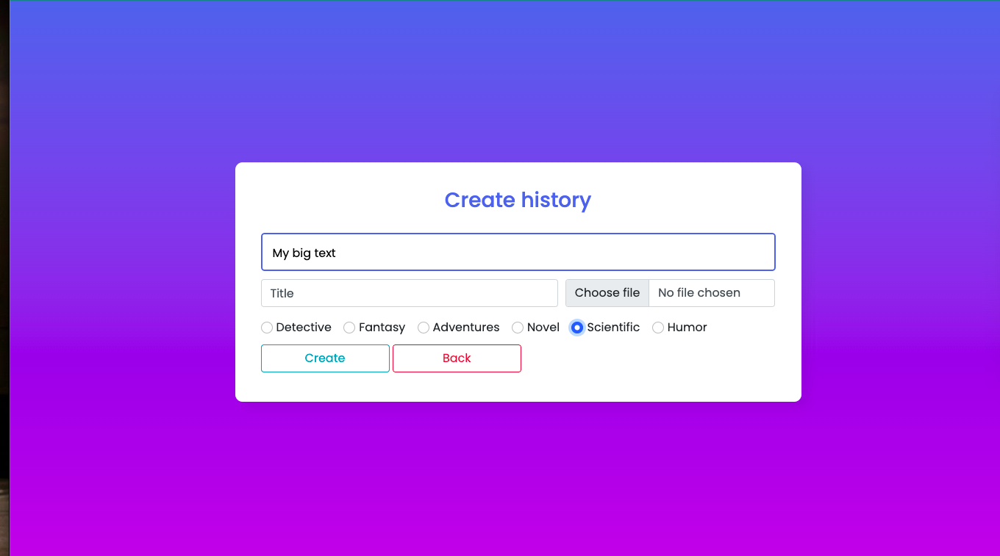
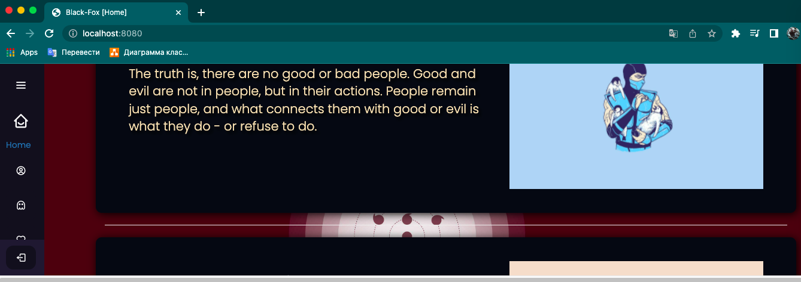

<h1 align="center"><a  href="https://github.com/Stas-ex/Diplom_Spring">Fanfiction site </a> </h1>

## Description
This application is intended for publishing small works.</br>
Users who first visited the site have limited access.
They can view the <b>Main</b> page.<br><br>
The page navigator is a pop-up menu located in the left corner of the browser. To open in full width, you must click on the icon located in the upper left corner.

**MAIN PAGE**
<p align="center">


</p>

Below are the pages of viewing works:

**WORK VIEW PAGE**
<p align="center">


</p>

The left page is a page for viewing all works, a feature is filtering works by tags, as well as dividing the viewing of works into pages. (21 works are placed on one page)
<br><br>
The right picture shows the page for viewing works.
Of the features, you can add to favorites and description comments, the possibility of consideration only by authorized users.
## How to write a work?
- **Register** an account.
- **Sign in**
- On the user page, click on the **"Create Story"** button
- **Create** it in the constructor
- And **publish**
- As easy as pie!
<p align="center">


</p>

## About the project.
**BACKEND**<br>
The server part of the application is written in Java. During the development, the universal Spring boot framework was used. The mechanisms for building authentication and authorization systems, as well as other security features, are represented by Spring Security.
MySQL was used as a DBMS.

**FRONTEND**<br>
The following languages were used to develop the visual part of the application:
- **Html** - a standardized document markup language for viewing web pages in a browser.
- **CSS** - a formal language for describing the appearance of a document written using a markup language.
- **JavaScript** is a multi-paradigm programming language.

The main part of the program was developed using the **Bootstrap** framework.
## Project setup
- Create database _spring_bd_
```
CREATE SCHEMA `spring_bd`
```
- Database initialization : Run Sql code written in file [V1__Init_DB.sql](src/main/resources/db/migration/V1__Init_DB.sql)
- Start project
- Follow the link in the browser: http://localhost:8080/



##Possible startup errors
- Error: The image is not saved on the server<br>
- Solution: open the file [FileDirectories.java](src/main/java/com/diploma/black_fox_ex/io/FileDirectories.java) and specify the absolute path to the presented directories in the project. 

**Example for my directory**
```
 USER_IMG("/.../Diploma_Spring/src/main/resources/img/user-img/")
 HISTORY_IMG("/.../Diploma_Spring/src/main/resources/img/history-img/");
```